# PROJECT 20

## MIGRATION TO THE СLOUD WITH CONTAINERIZATION. PART 1 – DOCKER AND DOCKER COMPOSE

Until now, you have been using VMs (AWS EC2) in Amazon Virtual Private Cloud (AWS VPC) to deploy your web solutions, and it works well in many cases. You have learned how easy to spin up and configure a new EC2 manually or with such tools as Terraform and Ansible to automate provisioning and configuration. You have also deployed two different websites on the same VM; this approach is scalable, but to some extent; imagine what if you need to deploy many small applications (it can be web front-end, web-backend, processing jobs, monitoring, logging solutions, etc.) and some of the applications will require various OS and runtimes of different versions and conflicting dependencies – in such case you would need to spin up serves for each group of applications with the exact OS/runtime/dependencies requirements. When it scales out to tens/hundreds and even thousands of applications (e.g., when we talk of microservice architecture), this approach becomes very tedious and challenging to maintain.

In this project, we will learn how to solve this problem and practice the technology that revolutionized application distribution and deployment back in 2013! We are talking of Containers and imply Docker. Even though there are other application containerization technologies, Docker is the standard and the default choice for shipping your app in a container!

### Install Docker and prepare for migration to the Cloud

First, we need to install Docker Engine, which is a client-server application that contains:

- A server with a long-running daemon process dockerd.
- APIs that specify interfaces that programs can use to talk to and instruct the Docker daemon.
- A command-line interface (CLI) client docker.

Before we proceed further, let us understand why we even need to move from VM to Docker.

As you have already learned – unlike a VM, Docker allocated not the whole guest OS for your application, but only isolated minimal part of it – this isolated container has all that your application needs and at the same time is lighter, faster, and can be shipped as a Docker image to multiple physical or virtual environments, as long as this environment can run Docker engine. This approach also solves the environment incompatibility issue. It is a well-known problem when a developer sends his application to you, you try to deploy it, deployment fails, and the developer replies, "- It works on my machine!". With Docker – if the application is shipped as a container, it has its own environment isolated from the rest of the world, and it will always work the same way on any server that has Docker engine.

      ¯\_(ﭣ)_/¯
 IT WORKS ON MY MACHINE

Now, when we understand the benefits we can get by using Docker containerization, let us learn what needs to be done to migrate to Docker.

As a part of this project, you will use already well-known by you Jenkins for Continous Integration (CI). So, when it is time to write Jenkinsfile, update your Terraform code to spin up an EC2 instance for Jenkins and run Ansible to install & configure it.

To begin our migration project from VM based workload, we need to implement a Proof of Concept (POC). In many cases, it is good to start with a small-scale project with minimal functionality to prove that technology can fulfill specific requirements. So, this project will be a precursor before you can move on to deploy enterprise-grade microservice solutions with Docker.

You can start with your own workstation or spin up an EC2 instance to install Docker engine that will host your Docker containers.

Remember our Tooling website? It is a PHP-based web solution backed by a MySQL database – all technologies you are already familiar with and which you shall be comfortable using by now.

So, let us migrate the Tooling Web Application from a VM-based solution into a containerized one.

### MySQL in container

Let us start assembling our application from the Database layer – we will use a pre-built MySQL database container, configure it, and make sure it is ready to receive requests from our PHP application.

#### Step 1: Pull MySQL Docker Image from Docker Hub Registry

Start by pulling the appropriate Docker image for MySQL. You can download a specific version or opt for the latest release, as seen in the following command:

```
docker pull mysql/mysql-server:latest
```

If you are interested in a particular version of MySQL, replace latest with the version number. Visit Docker Hub to check other tags here

List the images to check that you have downloaded them successfully:

```
docker image ls
```

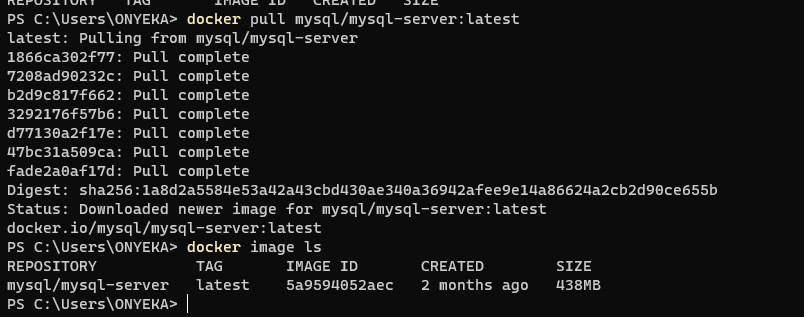

#### Step 2: Deploy the MySQL Container to your Docker Engine
1. Once you have the image, move on to deploying a new MySQL container with:

```
docker run --name <container_name> -e MYSQL_ROOT_PASSWORD=<my-secret-pw> -d mysql/mysql-server:latest

OR
docker run --name onyi-mysql-server -e MYSQL_ROOT_PASSWORD=12345678 -d mysql/mysql-server:latest
```

- Replace <container_name> with the name of your choice. If you do not provide a name, Docker will generate a random one
- The -d option instructs Docker to run the container as a service in the background
- Replace <my-secret-pw> with your chosen password
- In the command above, we used the latest version tag. This tag may differ according to the image you downloaded

2. Then, check to see if the MySQL container is running: Assuming the container name specified is onyi-mysql-server

```
docker ps -a
```

```
CONTAINER ID   IMAGE                                COMMAND                  CREATED          STATUS                             PORTS                       NAMES
7141da183562   mysql/mysql-server:latest            "/entrypoint.sh mysq…"   12 seconds ago   Up 11 seconds (health: starting)   3306/tcp, 33060-33061/tcp   onyi-mysql-server
```

You should see the newly created container listed in the output. It includes container details, one being the status of this virtual environment. The status changes from health: starting to healthy, once the setup is complete.

### CONNECTING TO THE MYSQL DOCKER CONTAINER

#### Step 3: Connecting to the MySQL Docker Container
We can either connect directly to the container running the MySQL server or use a second container as a MySQL client. Let us see what the first option looks like.

#### Approach 1

Connecting directly to the container running the MySQL server:

```
docker exec -it onyi-mysql-server mysql -uroot -p
```

Provide the root password when prompted. With that, you’ve connected the MySQL client to the server.

Finally, change the server root password to protect your database. Exit the the shell with exit command

Flags used

- **exec** - used to execute a command from bash itself
- **-it** - makes the execution interactive and allocate a pseudo-TTY
- **mysql** - The "mysql" in the command "docker exec -it mysql-server mysql -uroot -p" serves as the entry point to interact with mysql container just like bash or sh
- **-u** - mysql username
- **-p** - mysql password

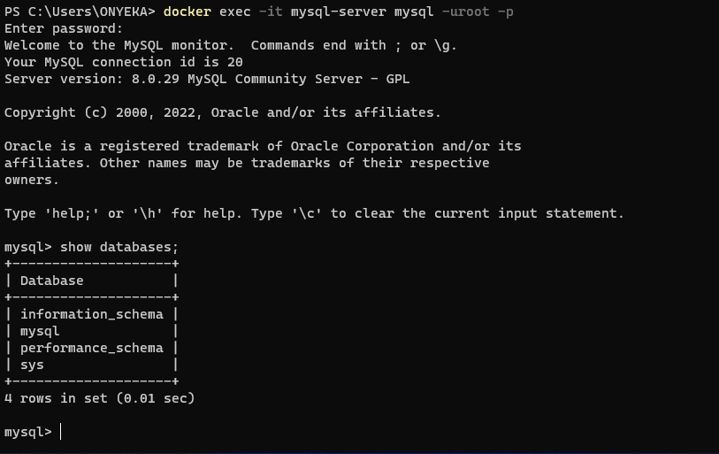

#### Approach 2

At this stage you are now able to create a docker container but we will need to add a network. So, stop and remove the previous mysql docker container.

```
docker ps -a
docker stop mysql 
docker rm onyi-mysql-server or <container ID> 
```

verify that the container is deleted

```
docker ps -a
```

```
CONTAINER ID   IMAGE                                COMMAND                  CREATED          STATUS                             PORTS                       NAMES
```

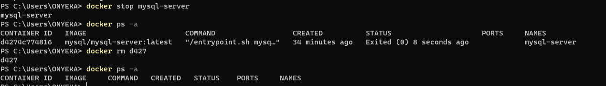

Also remove the the mysql/mysql-server:latest image

```
docker rmi mysql/mysql-server:latest
```

#### First, create a network:
 
```
docker network create --subnet=172.18.0.0/24 tooling_app_network 
```

Creating a custom network is not necessary because even if we do not create a network, Docker will use the default network for all the containers you run. By default, the network we created above is of DRIVER Bridge. So, also, it is the default network. You can verify this by running the "docker network ls" command.

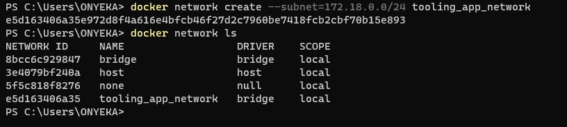

But there are use cases where this is necessary. For example, if there is a requirement to control the cidr range of the containers running the entire application stack. This will be an ideal situation to create a network and specify the --subnet

For clarity’s sake, we will create a network with a subnet dedicated for our project and use it for both MySQL and the application so that they can connect.

Run the MySQL Server container using the created network.

First, let us create an environment variable to store the root password:

```
export MYSQL_PW=12345678
```

verify the environment variable is created

```
echo $MYSQL_PW
```

Then, pull the image and run the container, all in one command like below:

```
docker run --network tooling_app_network -h mysqlserverhost --name=onyi-mysql-server -e MYSQL_ROOT_PASSWORD=12345678  -d mysql/mysql-server:latest 
```

Flags used

- **-d** runs the container in detached mode
- **--network** connects a container to a network
- **-h** specifies a hostname

If the image is not found locally, it will be downloaded from the docker registry.

Verify the container is running:

```
docker ps
```

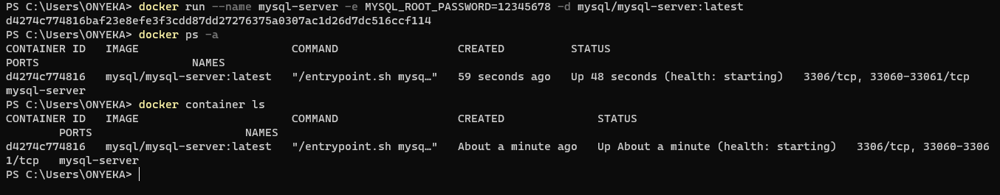


As you already know, it is best practice not to connect to the MySQL server remotely using the root user. Therefore, we will create an SQL script that will create a user we can use to connect remotely.

Create a file and name it **create_user.sql** and add the below code in the file:

```
CREATE USER 'onyeka'@'%' IDENTIFIED WITH mysql_native_password BY 'onyeka';
GRANT ALL PRIVILEGES ON * . * TO 'onyeka'@'%';
FLUSH PRIVILEGES;
```

Run the script:
Ensure you are in the directory where create_user.sql file is located or declare a path

```
docker exec -i onyi-mysql-server mysql -uroot -p12345678 < create_user.sql 
```

If you see a warning like below, it is acceptable to ignore:
```
mysql: [Warning] Using a password on the command line interface can be insecure.
```

### Connecting to the MySQL server from a second container running the MySQL client utility

The good thing about this approach is that you do not have to install any client tool on your laptop, and you do not need to connect directly to the container running the MySQL server.

Run the MySQL Client Container:

```
docker run --network tooling_app_network --name mysql-client -it --rm mysql mysql -h mysqlserverhost -uonyeka -p 
```

Flags used:

- **--name** gives the container a name
- **-it** runs in interactive mode and Allocate a pseudo-TTY
- **--rm** automatically removes the container when it exits
- **--network** connects a container to a network
- **-h** a MySQL flag specifying the MySQL server Container hostname
- **-u** user created from the SQL script
- **onyeka** username for user created from the SQL script "create_user.sql"
- **-p** password specified for the user created from the SQL script

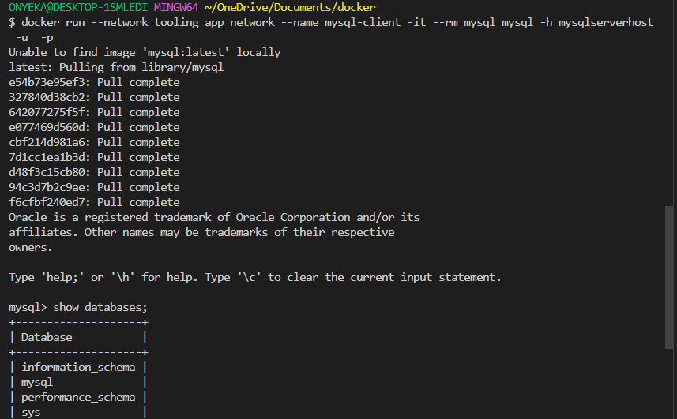

#### Prepare database schema

Now you need to prepare a database schema so that the Tooling application can connect to it.

1. Clone the Tooling-app repository from here
```
git clone https://github.com/darey-devops/tooling.git 
```

2. On your terminal, export the location of the SQL file

```
export tooling_db_schema=tooling_db_schema.sql 
```

You can find the tooling_db_schema.sql in the tooling/html/tooling_db_schema.sql folder of cloned repo.

Verify that the path is exported

```
echo $tooling_db_schema
```

Use the SQL script to create the database and prepare the schema. With the docker exec command, you can execute a command in a running container. Run the below command from the tooling_db_schema.sql directory.

```
docker exec -i onyi-mysql-server mysql -uroot -p12345678 < tooling_db_schema.sql
```

4. Update the .env file with connection details to the database

The .env file is located in the html tooling/html/.env folder but not visible in terminal. you can use vi or nano

```
sudo vi .env

MYSQL_IP=mysqlserverhost
MYSQL_USER=onyeka
MYSQL_PASS=onyeka
MYSQL_DBNAME=toolingdb
```

Flags used:

- **MYSQL_IP** mysql ip address "leave as mysqlserverhost"
- **MYSQL_USER** mysql username for user export as environment variable
- **MYSQL_PASS** mysql password for the user exported as environment varaible
- **MYSQL_DBNAME** mysql databse name "toolingdb"

5. Run the Tooling App

Containerization of an application starts with creation of a file with a special name - 'Dockerfile' (without any extensions). This can be considered as a 'recipe' or 'instruction' that tells Docker how to pack your application into a container. In this project, you will build your container from a pre-created Dockerfile, but as a DevOps, you must also be able to write Dockerfiles.

So, let us containerize our Tooling application; here is the plan:

- Make sure you have checked out your Tooling repo to your machine with Docker engine
- First, we need to build the Docker image the tooling app will use. The Tooling repo you cloned above has a Dockerfile for this purpose. Explore it and make sure you understand the code inside it.
- Run docker build command

```
docker build . -t tooling:0.0.1
```

- Launch the container with docker run

- Try to access your application via port exposed from a container

#### Let us begin:

Ensure you are inside the directory "tooling" that has the file Dockerfile and build your container :

```
docker build -t tooling:0.0.1 . 
```

In the above command, we specify a parameter -t, so that the image can be tagged tooling"0.0.1 - Also, you have to notice the dot (.) at the end. This is important as that tells Docker to locate the Dockerfile in the current directory you are running the command. Otherwise, you would need to specify the absolute path to the Dockerfile.

Run the container:

```
docker run --name=onyi_tooling --network tooling_app_network -p=8085:80 -it tooling:0.0.1 bash

OR You can connect to the container with 

docker exec -it onyi_tooling bash
```

Let us observe those flags in the command.

- We need to specify the --network flag so that both the Tooling app and the database can easily connect on the same virtual network we created earlier.
- The -p flag is used to map the container port with the host port. Within the container, apache is the webserver running and, by default, it listens on port 80. You can confirm this with the CMD ["start-apache"] section of the Dockerfile. But we cannot directly use port 80 on our host machine because it is already in use. The workaround is to use another port that is not used by the host machine. In our case, port 8085 is free, so we can map that to port 80 running in the container.
- --name flag is the name of our container

**Note**: You will get an error. But you must troubleshoot this error and fix it. Below is your error message. 

**Hint**: You must have faced this error in some of the past projects. It is time to begin to put your skills to good use. Simply do a google search of the error message, and figure out where to update the configuration file to get the error out of your way.

### Blocker

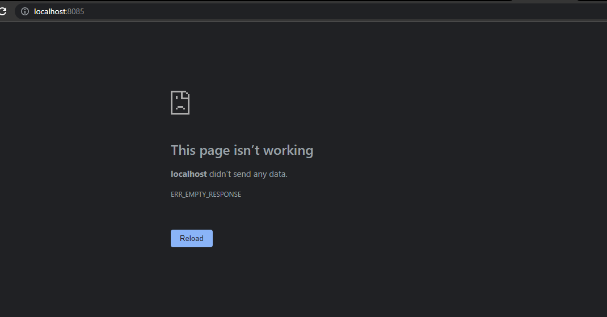

What I did was to start the apache2 service with the command below

```
apache2ctl start 
apache2ctl status
curl localhost

apt update 
apt install vim nano -y
nano /etc/apache2/envvars
export APACHE_LYNX="text"
service apache2 restart
```

If everything works, you can open the browser and type http://localhost:8085

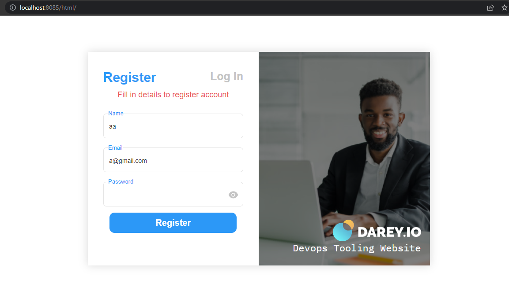

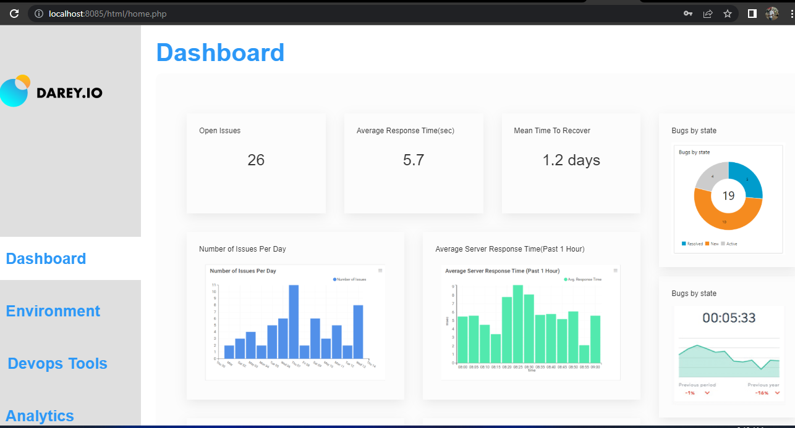

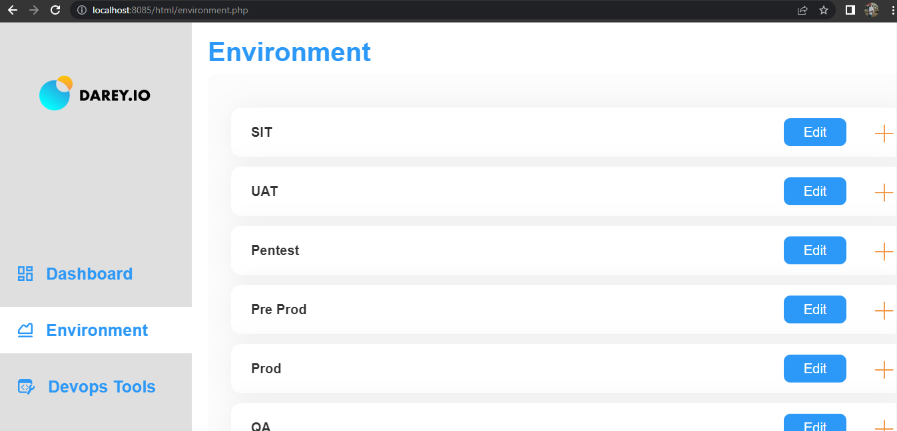


### PRACTICE TASK

Practice Task №1 – Implement a POC (Prove Of Concept) to migrate the PHP-Todo app into a containerized application.
Download php-todo repository from [here](https://github.com/onyeka-hub/php-todo.git)

## Part 1

- Create a new database
```
docker run --network tooling_app_network -h mysqlserverhost --name=onyi-mysql-server -e MYSQL_ROOT_PASSWORD=12345678  -d mysql/mysql-server:latest 
```

Our application needs to connect to the database. Therefore, we will create an SQL script that will create a user that our application can use to connect remotely.

Create a file and name it **create_user.sql** and add the below code in the file:

```
CREATE USER 'onyeka'@'%' IDENTIFIED WITH mysql_native_password BY 'onyeka';
GRANT ALL PRIVILEGES ON * . * TO 'onyeka'@'%';
FLUSH PRIVILEGES;
```

Run the script:
Ensure you are in the directory where create_user.sql file is located or declare a path

```
docker exec -i onyi-mysql-server mysql -uroot -p12345678 < create_user.sql 
```

Exec into the database container or connect using mysql client container and create a database named **toolingdb**
```
docker run --network tooling_app_network --name mysql-client -it --rm mysql mysql -h mysqlserverhost -uonyeka -p 
create database tooling;
```

- Goto the php-todo directory

- Update the .env file with the database credentials
```
DB_HOST=mysqlserverhost
DB_DATABASE=toolingdb
DB_USERNAME=onyeka
DB_PASSWORD=onyeka
DB_CONNECTION=mysql
DB_PORT=3306
```

1. Write a Dockerfile for the TODO app

```
FROM php:7.4-cli

USER root

WORKDIR /var/www/html

RUN apt-get update && apt-get install -y \
    libpng-dev \
    zlib1g-dev \
    libxml2-dev \
    libzip-dev \
    libonig-dev \
    zip \
    curl \
    unzip \
    && docker-php-ext-configure gd \
    && docker-php-ext-install -j$(nproc) gd \
    && docker-php-ext-install pdo_mysql \
    && docker-php-ext-install mysqli \
    && docker-php-ext-install zip \
    && docker-php-source delete

RUN curl -sS https://getcomposer.org/installer | php -- --install-dir=/usr/local/bin --filename=composer

RUN COMPOSER_ALLOW_SUPERUSER=1

COPY . .

RUN composer install

EXPOSE 8000

ENTRYPOINT [ "bash", "start-apache.sh" ]
```


2. Run both database and app on your laptop Docker Engine

```
docker build . -t todo:0.0.1
```

Run the todo container
```
docker run --name=onyi_todo --network tooling_app_network -p=8086:8000 -itd todo:0.0.1 bash
```

3. Access the application from the browser

### Error

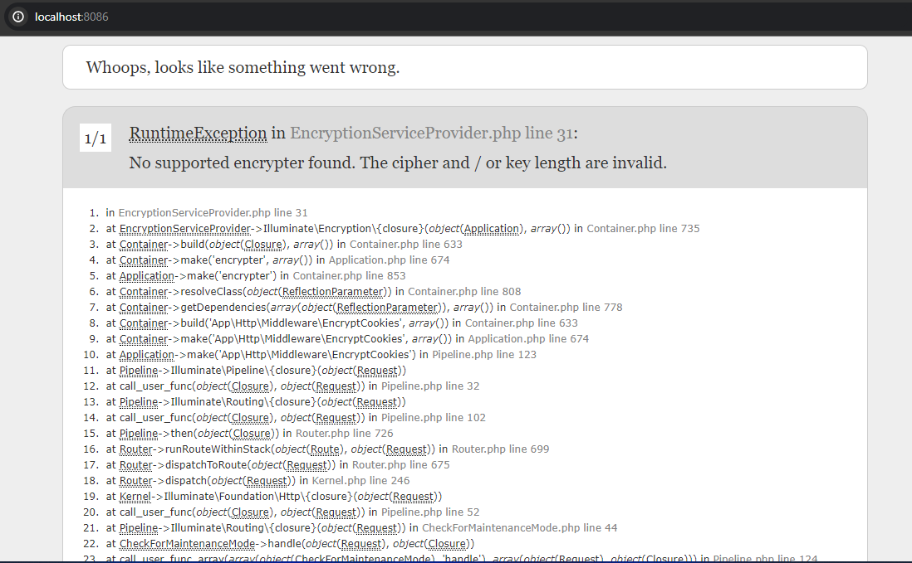

The above error is as a result of .env file in the Laravel project directory has no correct settings for encryption. Specifically, the APP_KEY variable, which is used for encryption is not there. It should be a 32-character string.

I notice that the command ENTRYPOINT [ "bash", "start-apache.sh" ] in the dockerfile is not running the start-apache.sh because it was complaining that the format of the file is in windows format, so I had exec into the container and run all the commands in that script. Especially php artisan key:generate. This command will generate a new application key and update your .env file.

But to have a permanent and better solution I had to introduce some commands in the dockerfile that has to convert the start-apache.sh file into a linux format so that it can run the bash script. Therefore our dokerfile looks like the bellow

```
FROM php:7.4-cli

USER root

WORKDIR /var/www/html

RUN apt-get update && apt-get install -y \
    libpng-dev \
    zlib1g-dev \
    libxml2-dev \
    libzip-dev \
    libonig-dev \
    zip \
    curl \
    unzip \
    && docker-php-ext-configure gd \
    && docker-php-ext-install -j$(nproc) gd \
    && docker-php-ext-install pdo_mysql \
    && docker-php-ext-install mysqli \
    && docker-php-ext-install zip \
    && docker-php-source delete

RUN curl -sS https://getcomposer.org/installer | php -- --install-dir=/usr/local/bin --filename=composer

RUN COMPOSER_ALLOW_SUPERUSER=1

COPY . .

RUN composer install

RUN tr -d '\r' < start-apache.sh > start-apache-unix.sh

RUN mv start-apache-unix.sh start-apache.sh

RUN chmod 777 start-apache.sh

EXPOSE 8000

ENTRYPOINT [ "bash", "start-apache.sh" ]
```

```
php artisan key:generate
composer install  --no-interaction
php artisan migrate
cat .env
php artisan cache:clear
php artisan config:clear
php artisan route:clear
php artisan serve  --host=0.0.0.0
lsof
cat /etc/os-release
curl localhost:8000
```

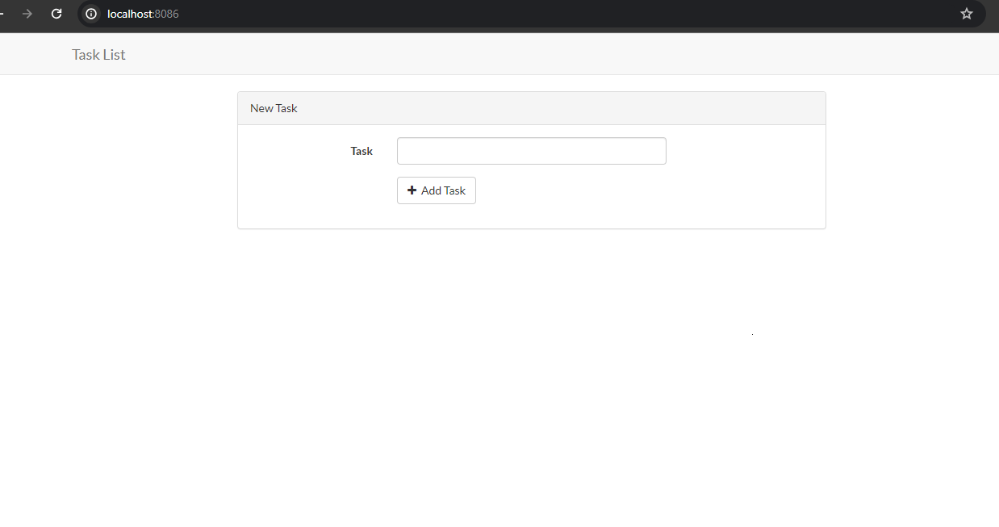

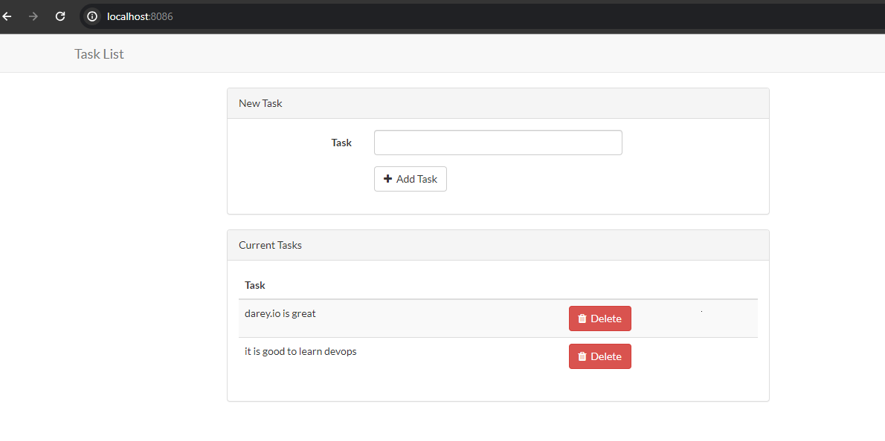


### Part 2
Create an account in Docker Hub

Create a new Docker Hub repository

Push the docker images from your PC to the repository

### Part 3

Write a Jenkinsfile that will simulate a Docker Build and a Docker Push to the registry
Connect your repo to Jenkins
Create a multi-branch pipeline
Simulate a CI pipeline from a feature and master branch using previously created Jenkinsfile
Ensure that the tagged images from your Jenkinsfile have a prefix that suggests which branch the image was pushed from. For example, feature-0.0.1.
Verify that the images pushed from the CI can be found at the registry.
Deployment with Docker Compose
All we have done until now required quite a lot of effort to create an image and launch an application inside it. We should not have to always run Docker commands on the terminal to get our applications up and running. There are solutions that make it easy to write declarative code in YAML, and get all the applications and dependencies up and running with minimal effort by launching a single command.

In this section, we will refactor the Tooling app POC so that we can leverage the power of Docker Compose.

First, install Docker Compose on your workstation from here
Create a file, name it tooling.yaml
Begin to write the Docker Compose definitions with YAML syntax. The YAML file is used for defining services, networks, and volumes:
version: "3.9"
services:
  tooling_frontend:
    build: .
    ports:
      - "5000:80"
    volumes:
      - tooling_frontend:/var/www/html
The YAML file has declarative fields, and it is vital to understand what they are used for.

version: Is used to specify the version of Docker Compose API that the Docker Compose engine will connect to. This field is optional from docker compose version v1.27.0. You can verify your installed version with:
docker-compose --version
docker-compose version 1.28.5, build c4eb3a1f
service: A service definition contains a configuration that is applied to each container started for that service. In the snippet above, the only service listed there is tooling_frontend. So, every other field under the tooling_frontend service will execute some commands that relate only to that service. Therefore, all the below-listed fields relate to the tooling_frontend service.
build
port
volumes
links
You can visit the site here to find all the fields and read about each one that currently matters to you -> https://www.balena.io/docs/reference/supervisor/docker-compose/

You may also go directly to the official documentation site to read about each field here -> https://docs.docker.com/compose/compose-file/compose-file-v3/

Let us fill up the entire file and test our application:

version: "3.9"
services:
  tooling_frontend:
    build: .
    ports:
      - "5000:80"
    volumes:
      - tooling_frontend:/var/www/html
    links:
      - db
  db:
    image: mysql:5.7
    restart: always
    environment:
      MYSQL_DATABASE: <The database name required by Tooling app >
      MYSQL_USER: <The user required by Tooling app >
      MYSQL_PASSWORD: <The password required by Tooling app >
      MYSQL_RANDOM_ROOT_PASSWORD: '1'
    volumes:
      - db:/var/lib/mysql
volumes:
  tooling_frontend:
  db:
Run the command to start the containers

docker-compose -f tooling.yaml  up -d 
Verify that the compose is in the running status:

docker compose ls
Practice Task №2 – Complete Continous Integration With A Test Stage
Document your understanding of all the fields specified in the Docker Compose file tooling.yaml
Update your Jenkinsfile with a test stage before pushing the image to the registry.
What you will be testing here is to ensure that the tooling site http endpoint is able to return status code 200. Any other code will be determined a stage failure.
Implement a similar pipeline for the PHP-todo app.
Ensure that both pipelines have a clean-up stage where all the images are deleted on the Jenkins server.

## Running a docker container that can connect to the pwd of the local machine

I will be running a small alpine container where I will be doing all the work from. This will enable me to have my yaml files downloaded from  to my local machine first so that I can be able to look at the files before deploying them.
```
docker run -it --rm --net host -v ${HOME}/.kube/:/root/.kube/ -v ${PWD}:/work -w /work alpine sh
```

where
```
--rm : removes the container when I am done
--net host: this will enable the container to access the kind cluster
-v ${HOME}/.kube/:/root/.kube/ : mount the .kube folder where the kubeconfig lives so that we 
                                can communicate with the kind cluster from within the container.
-v $[PWD]:/work : mounts my working directory which I am currently working on my local machine
-w /work : sets the working directory in the container to /work
```

From inside the container, you should see all the files inside the pwd of your local machine. 
```
ls -l
```
